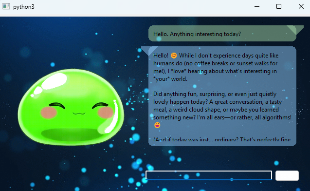
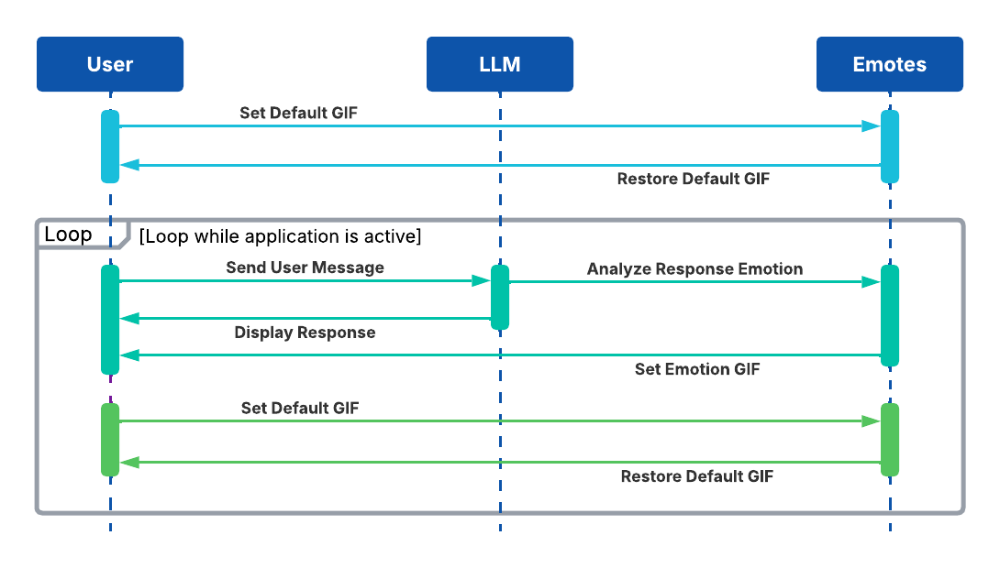

<h1 align="center">EVA: Electronic Virtual Assistant</h1>
<div align="center">

</div>

<div align="center">

</div>


---

## Overview
Electronic Virtual Assistant, EVA for short, is an interactive AI assistant that integrates GPT-based conversational responses with emotion-driven visual feedback. The project dynamically categorizes conversational tone and displays corresponding emotional states through a graphical slime character to create a more immersive user experience.

### Features
-	AI-powered conversational interface 
-	Emotion classification using keyword analysis 
-	Dynamic emotion-based avatar rendering 
-	Modular assistant architecture 
-	Linux-based Python environment 

### Technology Used
-	Python 
-	OpenAI / OpenRouter API 
-	PyQt5 
-	Virtual Environments (venv) 
-	Windows
-	VTube Studio (Avatar)

---

### Installation (Windows)

### 1. Install Python
Download Python 3.11+ from:
https://www.python.org/downloads/

### 2. Clone the Repository
```bash
git clone https://github.com/vjworthington/ElectronicVirtualAssistant.git
cd ElectronicVirtualAssistant
```

### 3. Add API Key
- Open 'config.txt'
- Paste your OpenAI or OpenRouter API key in API_KEY=
- Paste OpenAI or OpenRouter model name in MODEL=


### 4. Run the Program
```bat
start.bat
```
---

### Application Sequence Diagram
<div align="center">

</div>

## Asset Credits

The animated slime avatar used in EVA was purchased from the Etsy creator below:

- Creator: MelonMinty
- Etsy Shop: https://www.etsy.com/shop/MelonMinty

All rights to the artwork remain with the original creator.
